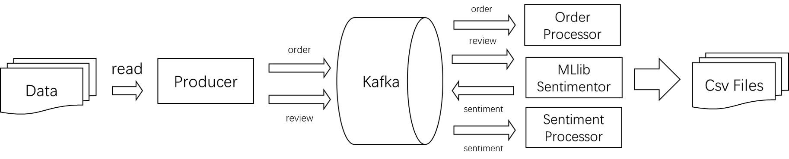

## Olist E-Commerce Data Real-time Analysis
This is a real-time analyzer for an e-commerce system based on Kafka and Spark. 

The analyzer can output a real-time top-10 rated(based on sentiment analysis) and purchased products with streaming data input. The overall structure is shown in the figure below.

### Description

#### [Data](https://www.kaggle.com/olistbr/brazilian-ecommerce?select=olist_orders_dataset.csv.)
The data is from Kaggle by Olist. It has 100k purchase records from 2016 to 2018 and part of them have review
records, anonymized customer information, seller information, and product information.
In our project, although the dataset are static files, we will read the
purchase and review records in stream to simulate those behaviors.

#### [Producer](producer.ipynb)
A producer that reads from files and produces streaming data to Kafka based on the timestamps is implemented

#### [Sentimentor](consumer_review.py)
Train a sentimentor ML model using SparkML and accepts review topic from Kafka and produces sentiment topic to Kafka

#### [Sentiment Processor](consumer_sent/consumer_sent.scala)
A sentiment processor module that accepts sentiment topic from Kafka and display real-time top 10 rated products

#### [Order Processor](consumer_order/consumer_order.scala)
An order processor module that accepts product topic from Kafka and display real-time top 10 purchased products

### Tools
- Language: Python, Scala
- Streaming Processing: Spark Sturctured Streaming
- Messaging System: Kafka
- Sentimnet Analyzer: SparkML
